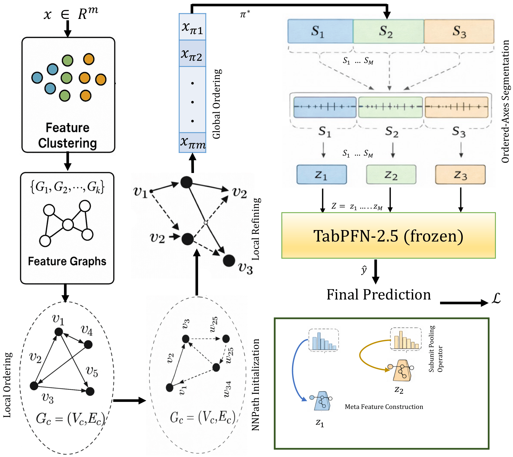

# GOTabPFN: From Feature Ordering to Compact Tokenization for Tabular Foundation Models on High-Dimensional Data (ICML 2026)


[](https://icml.cc/virtual/2026/poster/62523)


<p align="center">
  
</p>

<p align="center">
  <em>Overview of GOTabPFN: graph-guided feature ordering, NSC meta-feature construction, and frozen TabPFN-2.5 inference.</em>
</p>

GOTabPFN is a theory-grounded representation interface for making small **TabPFN-style tabular foundation models** effective in **High-Dimensional, Low-Sample Size (HDLSS)** regimes, where the number of features is much larger than the number of samples. The method combines **Graph-guided Ordering with Local Refinement (GO-LR)** and **Neuro-Inspired Subunit Compression (NSC)**. GO-LR builds cluster-wise feature graphs `G_c` from local sample contexts, treats features as graph nodes, and learns a single global feature order `Pi*` using a MinLA-grounded objective with TSP-path-style initialization and local refinement. In the architecture diagram, the **Feature Clustering** block is a high-level shorthand for discovering local feature-dependence groups through these cluster-wise feature graphs; it is not a separate prediction module. NSC then uses the learned order to segment adjacent features into contiguous neighborhoods and compress each segment into a scalar meta-feature, producing a compact token vector `Z(x) = (z_1, ..., z_M)`, where `M << m` and the token budget is tied to intrinsic dimensionality estimates rather than raw feature count. These tokens are passed to a **frozen TabPFN-2.5 head**, allowing GOTabPFN to improve high-dimensional compatibility without retraining or modifying the TabPFN backbone. This ordering-to-tokenization design is motivated by the observation that unordered HDLSS feature spaces often contain local redundancy and dependence structure that standard global compression or direct foundation-model inference may fail to exploit. Across 8 biomedical HDLSS benchmarks, GOTabPFN achieves the best accuracy on every dataset and an average rank of `1.00 ± 0.00` against 50+ baselines, while additional cross-domain experiments show the best average rank on 8 more high-dimensional datasets spanning text, face-image, image-feature, sensor, and RNA-seq domains. Overall, GOTabPFN provides a practical route to scalable in-context tabular prediction under tight feature budgets by turning very high-dimensional raw tables into stable, locality-preserving meta-feature representations for frozen TabPFN-style inference.

## Overview

**GOTabPFN** is designed for high-dimensional tabular datasets where standard TabPFN-style predictors become difficult to use directly due to large feature counts. It takes a raw feature matrix and labels, learns an ordered and compressed representation, and then performs prediction using a **frozen TabPFN-2.5 head**.

The pipeline has three main stages:

1. **GO-LR** learns a global feature order `Pi*` from cluster-wise feature graphs.
2. **NSC** segments the ordered feature axis and compresses each segment into a compact meta-feature.
3. **TabPFN-2.5** performs prediction on the compressed token vector `Z(x)`.

GOTabPFN is not limited to biomedical datasets. It can be applied to any high-dimensional tabular dataset with a compatible feature matrix and target labels, including biomedical, transcriptomic, text, sensor, and image-feature datasets.

In the architecture diagram, the 'Feature Clustering' block is a high-level visual shorthand for discovering local feature-dependence groups through cluster-wise feature graphs. The final output of GO-LR is a single global feature order, which NSC uses to produce compact tokens for frozen TabPFN-style inference.

## Citation

Al Zadid Sultan Bin Habib, Md Younus Ahamed, Prashnna Gyawali, Gianfranco Doretto, and Donald A. Adjeroh. **“GOTabPFN: From Feature Ordering to Compact Tokenization for Tabular Foundation Models on High-Dimensional Data.”** In *Proceedings of the 43rd International Conference on Machine Learning (ICML)*, 2026.

BibTeX:
```bibtex
@inproceedings{habib2026gotabpfn,
  title     = {{GOTabPFN: From Feature Ordering to Compact Tokenization for Tabular Foundation Models on High-Dimensional Data}},
  author    = {Habib, Al Zadid Sultan Bin and Ahamed, Md Younus and Gyawali, Prashnna and Doretto, Gianfranco and Adjeroh, Donald A.},
  booktitle = {Proceedings of the 43rd International Conference on Machine Learning},
  year      = {2026}
}
```

- Find it on ICML portal: https://icml.cc/virtual/2026/poster/62523
- Project Webpage: https://www.zadidhabib.com/gotabpfn.html

## Files and Repository Structure

### Python package: `gotabpfn/`

This folder contains the core GOTabPFN implementation and standalone utility modules:

- `__init__.py` - Package initializer and high-level API exports.
- `gotabpfn.py` - Main GOTabPFN implementation, including:
  - `GraphFeatureOrdering` for graph-guided feature ordering.
  - `pidf_segpca` / NSC-pSP for PCA-IDF-aware segment-wise compression.
  - `TabPFN25Head` and `TabPFN25Config` for using a frozen TabPFN-2.5 classifier/regressor head.
  - End-to-end components for feature ordering, compact tokenization, and TabPFN-based prediction.
- `GO-LR.py` - Standalone Graph-guided Ordering with Local Refinement (GO-LR) module. It can be used independently as a feature-ordering/metaheuristic algorithm and reports ordering runtime, TSP path cost, MinLA cost, learned ordering, and reordered feature tables.
- `NSC-pSP.py` - Standalone NSC-pSP compression module: PCA-IDF-aware segment-wise principal subspace projection.
- `NSC-SP.py` - Standalone NSC-SP compression module: segment-wise principal subspace projection with user-provided `M` or `d_hat`.
- `NSC-P.py` - Standalone NSC-P compression module: PCA-IDF-aware descriptor/statistics-based compression.
- `NSC.py` - Standalone original NSC descriptor/statistics-based compression module.
- `gotabpfn_dataset_diagnostics.py` - Dataset-level diagnostics for IDF/FOE/`P_success`, locality gains, LES, and AUC under the cumulative explained variance-IDF curve.

### Experiment notebooks: `GOTabPFN Experiments/`

This folder contains experiment notebooks used during the initial submission and rebuttal/ablation period. Some notebooks may reflect earlier package/module names or earlier experimental scripts, but they are retained for reproducibility and transparency. Some notebooks contain full Optuna tuning scripts, while others provide fixed-run scripts using the best GO-LR and NSC hyperparameters found after Optuna search.

Representative notebooks include:

- **`GOLR_NSC_TabICL_Colon.ipynb`** and **`GOLR_NSC_TabICL_Lung.ipynb`**  
  Experiments combining GO-LR ordering and NSC compression with TabICL-style evaluation baselines.
- **`GOTabPFN_Colon_exp.ipynb`**, **`GOTabPFN_Lung.ipynb`**, **`GOTabPFN_ALLAML.ipynb`**, **`GOTabPFN_Arcene.ipynb`**, **`GOTabPFN_SMK.ipynb`**, **`GOTabPFN_TOX.ipynb`**  
  Portion of the main HDLSS dataset experiments for GOTabPFN.
- **`GOTabPFN_BASEHOCK.ipynb`**, **`GOTabPFN_RELATHE.ipynb`**, **`GOTabPFN_Cell_Cycle.ipynb`**, **`GOTabPFN_DrivFace_Classification.ipynb`** 
  Portion of the cross-domain tabular experiments.
- **`GOTabPFN_Colon_AUC_F1.ipynb`**  
  Additional AUC/F1 evaluation for Colon.
- **`GOTabPFN_ClusterSizeAblation.ipynb`**  
  Cluster-size sensitivity/ablation experiments.
- **`GOTabPFN_Seed_Sensitivity.ipynb`**  
  TabPFN seed sensitivity analysis.

### Package test notebook

- **`GOTabPFN_Package_Test.ipynb`**  
  Tests the local package setup. This notebook checks package imports, GO-LR as a standalone metaheuristic ordering module, the four NSC compression variants, and binary (Colon)/multiclass (orlaws10P)/regression (DrivFace) runs on a separate local machine.


- **`GOTabPFN_PIP_Install_Check.ipynb`**  
  Minimal notebook for checking the installed `gotabpfn` package after `pip install`. It will verify imports, initialize core modules, and run a toy workflow.

### Main dependencies

The repository uses the following main dependencies:

```txt
numpy>=1.23
pandas>=1.5
scipy>=1.11
scikit-learn>=1.2
tqdm>=4.64
optuna>=3.5
torch>=2.1
tabpfn==6.3.1
kmeans-gpu==0.0.5
matplotlib>=3.7
```

### Other top-level files

- **`requirements.txt`** - Python dependencies required to run the GOTabPFN package and notebooks.
- **`GOTabPFN_Architecture.png`** - High-level architecture diagram of the GOTabPFN framework.
- **`LICENSE`** - MIT license for this repository.
- **`README.md`** - Project overview, installation, usage instructions, repository structure, and citation information.
- **`.gitignore`** - Standard Git ignore rules for Python, Jupyter, cache files, checkpoints, and experiment outputs.
- **`pyproject.toml`** - Modern Python build-system and package metadata file for installation and PyPI upload.
- **`setup.cfg`** - Optional setuptools configuration file for package metadata and installation settings, if used alongside `pyproject.toml`.


### Tested Environment

The package has been tested primarily with:

- Python 3.10+
- numpy 1.23+
- pandas 1.5+
- scipy 1.11+
- scikit-learn 1.2+
- tqdm 4.64+
- optuna 3.5+
- torch 2.1+
- tabpfn 6.3.1
- kmeans-gpu 0.0.5
- matplotlib 3.7+
- jupyterlab 4.0+

The main experiments were conducted on the TITAN cluster (`x86_64`, 188 GB RAM, 8 × NVIDIA TITAN RTX GPUs, 24 GB VRAM per GPU). Additional diagnostics, package tests, and fixed-parameter runs were executed on Vulcan, an 8-GPU NVIDIA RTX A6000 machine with 8 × 49 GB VRAM, 2 × Intel Xeon Gold 5320 CPUs, and 503 GB RAM. Therefore, small numerical/runtime differences from the main paper results may be observed depending on hardware configuration. The PyPI-installed package was also checked and tested on Google Colab. On the first run, TabPFN may download the required TabPFN-2.5 checkpoint from Hugging Face; the checkpoint is cached afterward.

## Installation

You can install **GOTabPFN** in several ways depending on your workflow.

### Option 1: Clone the Repository (Recommended for Development)

```bash
git clone https://github.com/zadid6pretam/GOTabPFN.git
cd GOTabPFN
pip install -r requirements.txt
pip install -e .
```


### Option 2: Install Directly from GitHub

```bash
pip install "git+https://github.com/zadid6pretam/GOTabPFN.git"
```


### Option 3: Use a Virtual Environment

```bash
python -m venv gotabpfn-env
source gotabpfn-env/bin/activate  # On Windows: gotabpfn-env\Scripts\activate

git clone https://github.com/zadid6pretam/GOTabPFN.git
cd GOTabPFN
pip install -r requirements.txt
pip install -e .
```


### Option 4: Local Install Without Editable Mode

```bash
git clone https://github.com/zadid6pretam/GOTabPFN.git
cd GOTabPFN
pip install -r requirements.txt
pip install .
```


### Option 5: Install from PyPI

```bash
pip install gotabpfn
```

## Dataset Compatibility and Preprocessing Guidelines

GOTabPFN is designed for tabular datasets, with particular focus on high-dimensional low-sample size tabular data where the number of features can be much larger than the number of samples. Typical examples include gene expression datasets, biomedical tabular datasets, document-term/tabular representations, extracted image feature embeddings, sensor derived data, and other numeric high-dimensional datasets.

### Supported Task Types

GOTabPFN supports:

- **Binary classification**
- **Multiclass classification**
- **Regression**

The task type is controlled through the TabPFN head configuration:

```python
TabPFN25Config(task_type="binary", ...)
TabPFN25Config(task_type="multiclass", ...)
TabPFN25Config(task_type="regression", ...)
```
- For classification, labels should be encoded as class labels. The example notebooks usually apply LabelEncoder or convert labels into contiguous integer classes before training. For regression, the target column should contain continuous numeric values.


### Expected input format

The recommended input format is a **CSV file** where:

- Rows correspond to samples.
- Columns correspond to features.
- One column is used as the target column.
- Feature columns should be numeric or convertible to numeric values.

- Example for classification:

```text
feature_1,feature_2,feature_3,...,label
0.12,1.48,-0.33,...,1
0.08,1.21,-0.52,...,0
...
```
- Example for regression:

```text
feature_1,feature_2,feature_3,...,target
0.12,1.48,-0.33,...,35.7
0.08,1.21,-0.52,...,42.1
...
```


### Numeric features

GOTabPFN’s GO-LR ordering and NSC compression modules operate on numeric feature matrices. Therefore, the safest setup is to provide a CSV where all feature columns are numeric after removing the target column.

If non-numeric columns are present, the provided notebook scripts and wrappers can drop them automatically. For example, columns containing sample IDs, filenames, text IDs, or categorical strings can be removed before fitting:

```python
num_cols = X_df.select_dtypes(include=[np.number]).columns.tolist()
X_df = X_df[num_cols]
```
- This is useful for datasets that include metadata columns such as:

```text
sample_id
patient_id
cell
filename
image_path
group_name
```
- These columns should not be used directly as numeric features unless they have been properly encoded.


### Categorical features

The current GOTabPFN release is primarily intended for numeric tabular features. If your dataset contains categorical columns, recommended options are:

1. Drop non-numeric categorical columns if they are identifiers or metadata.
2. Encode meaningful categorical variables before using GOTabPFN.
3. Avoid using arbitrary ID columns as categorical features, because they can introduce spurious ordering or leakage.

Simple label encoding may be acceptable for ordinal categories, but for nominal categories, one-hot encoding or another appropriate categorical encoding should be considered before running GOTabPFN.

### Missing Values

GOTabPFN expects a numeric matrix without `NaN` or infinite values. The example scripts typically handle missing values by replacing invalid values with zero:

```python
X = np.nan_to_num(
    X,
    nan=0.0,
    posinf=0.0,
    neginf=0.0,
).astype(np.float32)
```
- For more careful preprocessing, especially in applied datasets, users may prefer median imputation:

```python
X_num = X_num.fillna(X_num.median(numeric_only=True))
X_num = X_num.fillna(0.0)
```

- The same preprocessing rule used for training data should also be applied to validation/test data. In cross-validation experiments, imputation and scaling should ideally be fit on the training fold only and then applied to the validation fold.


### Feature scaling

Feature scaling is recommended. In most experiments, GOTabPFN uses standardization:

```python
from sklearn.preprocessing import StandardScaler

scaler = StandardScaler()
X_scaled = scaler.fit_transform(X).astype(np.float32)
```
- For cross-validation, the leakage-safe version is:

```python
scaler = StandardScaler()
X_train = scaler.fit_transform(X_train_raw).astype(np.float32)
X_valid = scaler.transform(X_valid_raw).astype(np.float32)
```
- Some released experiment scripts use global standardization to match the original experimental protocol. For new experiments or real applications, fold-wise standardization is usually preferred.


### Target preprocessing

For classification, the target should be encoded into integer class labels:

```python
from sklearn.preprocessing import LabelEncoder

le = LabelEncoder()
y = le.fit_transform(y_raw).astype(np.int64)
```
- For binary classification, labels should become:
```text
0, 1
```
- For multiclass classification, labels should become:
```text
0, 1, 2, ..., C-1
```
- For regression, the target should be numeric:
```text
y = pd.to_numeric(df[target_col], errors="coerce")
y = y.fillna(y.median())
y = y.to_numpy(dtype=np.float32)
```


### Dataset size and dimensionality

GOTabPFN is especially useful for high-dimensional regimes, including:

- **HDLSS**: high-dimensional, low-sample-size datasets.
- Datasets where feature ordering may expose local structure.
- Datasets where compact tokenization can reduce the feature space before passing data to TabPFN-2.5 interface.

The method can also run on lower-dimensional datasets, but the benefits of feature ordering and NSC compression are expected to be stronger when the feature space contains redundancy, correlated feature groups, or structured feature neighborhoods.

### TabPFN Constraints

GOTabPFN uses a frozen TabPFN-2.5 head through `tabpfn==6.3.1`. Therefore, it inherits the practical constraints of the installed TabPFN version.

In general:

- Classification tasks should stay within the class-count limit supported by TabPFN.
- Very large sample sizes may require subsampling, batching strategies, or another downstream model.
- The first run may download a TabPFN-2.5 checkpoint from Hugging Face. The checkpoint is cached afterward.

For best reproducibility, use:

```txt
pip install tabpfn==6.3.1
```


### GO-LR feature ordering input

The GO-LR module expects a numeric matrix:

```python
X.shape == (n_samples, n_features)
```
- GO-LR learns a feature ordering:
```python
Pi_star = [feature_index_1, feature_index_2, ..., feature_index_m]
```

The standalone GO-LR.py wrapper can take a CSV file, drop the target column, keep numeric features, run ordering, and save:
- reordered feature table,
- learned feature ordering,
- ordering runtime,
- TSP path cost,
- MinLA cost.

Example:
```python
from gotabpfn import run_golr_csv

result = run_golr_csv(
    csv_path="coloncancer_encoded.csv",
    target_col="label",
    dataset_name="Colon",
    metric="euclidean",
    num_clusters=10,
    refine_passes=3,
    direction_select=True,
    out_prefix="colon_golr",
)
```


### NSC compression input

The NSC modules expect:

- a numeric feature matrix,
- a learned or identity feature ordering,
- optional hyperparameters controlling segmentation and compression.

The main GOTabPFN variant uses **NSC-pSP**, which combines PCA-IDF-aware budget selection with segment-wise principal subspace projection.

The package also includes standalone variants:

- `NSC-pSP.py`: PCA-IDF-aware segment-wise projection.
- `NSC-SP.py`: segment-wise projection with fixed/provided compression budget.
- `NSC-P.py`: PCA-IDF-aware descriptor/statistics pooling.
- `NSC.py`: original descriptor/statistics pooling.

### Recommended Minimal Preprocessing Pipeline

For most users, the recommended preprocessing workflow is:

```python
import pandas as pd
import numpy as np
from sklearn.preprocessing import StandardScaler, LabelEncoder

df = pd.read_csv("dataset.csv")

target_col = "label"
y_raw = df[target_col]
X_df = df.drop(columns=[target_col])

# Keep numeric features only
X_df = X_df.select_dtypes(include=[np.number])

# Handle missing values
X_df = X_df.apply(pd.to_numeric, errors="coerce")
X_df = X_df.fillna(X_df.median(numeric_only=True))
X_df = X_df.fillna(0.0)

# Scale features
scaler = StandardScaler()
X = scaler.fit_transform(X_df.values).astype(np.float32)

# Encode labels for classification
le = LabelEncoder()
y = le.fit_transform(y_raw).astype(np.int64)
```
For regression, replace the target preprocessing with:
```python
y = pd.to_numeric(y_raw, errors="coerce")
y = y.fillna(y.median())
y = y.to_numpy(dtype=np.float32)
```


### What users do not need to do

Users do not need to manually construct a feature graph, manually define feature neighborhoods, or manually create TabPFN tokens. GOTabPFN handles:

- graph-guided feature ordering,
- local refinement of the ordering,
- feature segmentation,
- NSC compression/tokenization,
- TabPFN-2.5 prediction head fitting.

Users mainly need to provide a clean numeric feature matrix and a target column.

### Practical Notes

- Remove sample IDs, filenames, patient IDs, and other non-feature metadata before training.
- Standardize features before GO-LR and NSC.
- Use fold-wise preprocessing for strict cross-validation.
- Use `tabpfn==6.3.1` for TabPFN-2.5 compatibility.
- The first TabPFN run may download the required checkpoint from Hugging Face.
- GPU is recommended for faster experiments, but some components can fall back to CPU.
- Runtime and numerical results may vary slightly across hardware configurations.


## Example Usage

Below is a minimal example showing how to train **GOTabPFN**:

### Example 1: Binary Classification with Fixed GOTabPFN Hyperparameters

This example runs GOTabPFN on a binary-classification CSV dataset using fixed GO-LR and NSC-pSP hyperparameters. The dataset should contain numeric feature columns and one target column.

The hyperparameters below correspond to the Colon configuration reported in the paper. For other datasets, users can tune these values or replace them with the dataset-specific settings reported in the appendix.

```python
import numpy as np
import pandas as pd
import torch

from sklearn.model_selection import RepeatedStratifiedKFold
from sklearn.preprocessing import StandardScaler, LabelEncoder
from sklearn.metrics import accuracy_score, f1_score, roc_auc_score

from gotabpfn import GraphFeatureOrdering, pidf_segpca, TabPFN25Head, TabPFN25Config


# -----------------------
# User settings
# -----------------------
DATA_FILE = "coloncancer_encoded.csv"  # change your dataset file name
TARGET_COL = "label"                   # change your dataset target column
SEED = 42

# Fixed GOTabPFN hyperparameters
GO_METRIC = "euclidean"
GO_NUM_CLUSTERS = 10
GO_REFINE_PASSES = 3
GO_DIRECTION_SELECT = True

NSC_SEGMENTATION = "equal_mass"
NSC_M_RULE = "idf"
NSC_TAU = 0.99
NSC_GAMMA = 1.7570143129240916
NSC_BETA = 0.2244046472232107
NSC_MMIN = 64
NSC_MMAX = 384
NSC_LMIN = 16
ASSUME_STANDARDIZED = False

TABPFN_SEED = 42
DEVICE = "cuda" if torch.cuda.is_available() else "cpu"


# -----------------------
# Utility
# -----------------------
def compute_deltas_adjacent_corr(X_tr, Pi_star, eps=1e-12):
    """
    Compute adjacent transition scores along the GO-LR order:
        delta_t = 1 - |corr(feature_t, feature_{t+1})|.

    Required for transition-aware NSC segmentation rules:
        - equal_mass
        - largest_jump
    """
    X_t = torch.from_numpy(X_tr).float()
    perm = torch.tensor(Pi_star, dtype=torch.long)

    Xp = X_t[:, perm]
    Xc = Xp - Xp.mean(dim=0, keepdim=True)
    std = Xc.std(dim=0, unbiased=False, keepdim=True).clamp_min(eps)
    Z = Xc / std

    corr_adj = (Z[:, :-1] * Z[:, 1:]).mean(dim=0)
    deltas = 1.0 - corr_adj.abs()

    return deltas.cpu()


# -----------------------
# Load and preprocess data
# -----------------------
df = pd.read_csv(DATA_FILE)

if TARGET_COL not in df.columns:
    raise ValueError(f"TARGET_COL='{TARGET_COL}' not found in the CSV file.")

y_raw = df[TARGET_COL].astype(str).fillna("missing_target")
X_df = df.drop(columns=[TARGET_COL])

# Keep numeric features only
X_df = X_df.select_dtypes(include=[np.number])
X_df = X_df.apply(pd.to_numeric, errors="coerce")
X_df = X_df.fillna(X_df.median(numeric_only=True)).fillna(0.0)

if X_df.shape[1] == 0:
    raise ValueError("No numeric feature columns found after preprocessing.")

# Encode labels
le = LabelEncoder()
y = le.fit_transform(y_raw).astype(np.int64)

num_classes = len(le.classes_)
if num_classes != 2:
    raise ValueError(
        f"This example expects binary classification, but found {num_classes} classes."
    )

# Standardize features
scaler = StandardScaler()
X = scaler.fit_transform(X_df.values).astype(np.float32)

print(f"X shape: {X.shape}")
print(f"Classes: {list(le.classes_)}")
print(f"Using device: {DEVICE}")


# -----------------------
# Learn GO-LR feature ordering once
# -----------------------
go = GraphFeatureOrdering(
    num_clusters=GO_NUM_CLUSTERS,
    metric=GO_METRIC,
    refine=True,
    direction_select=GO_DIRECTION_SELECT,
    refine_passes=GO_REFINE_PASSES,
)

try:
    Pi_star, _, _, _ = go.fit(
        X,
        seed=SEED,
        deterministic=True,
        use_cpu_kmeans=False,
    )
except Exception:
    Pi_star, _, _, _ = go.fit(
        X,
        seed=SEED,
        deterministic=True,
        use_cpu_kmeans=True,
    )

Pi_star = list(map(int, Pi_star))

print(f"Learned GO-LR order length: {len(Pi_star)}")


# -----------------------
# 5x5 cross-validation
# -----------------------
rkf = RepeatedStratifiedKFold(
    n_splits=5,
    n_repeats=5,
    random_state=SEED,
)

head_cfg = TabPFN25Config(
    task_type="binary",
    num_classes=2,
    device=DEVICE,
    random_state=TABPFN_SEED,
)

accs, f1s, aucs = [], [], []

for fold_id, (tr_idx, va_idx) in enumerate(rkf.split(X, y), start=1):
    X_tr, X_va = X[tr_idx], X[va_idx]
    y_tr, y_va = y[tr_idx], y[va_idx]

    nsc = pidf_segpca(
        segmentation=NSC_SEGMENTATION,
        l_min=NSC_LMIN,
        m_rule=NSC_M_RULE,
        gamma=NSC_GAMMA,
        beta=NSC_BETA,
        tau=NSC_TAU,
        M_min=NSC_MMIN,
        M_max=NSC_MMAX,
        assume_standardized=ASSUME_STANDARDIZED,
        device=DEVICE,
    )

    X_tr_t = torch.from_numpy(X_tr)

    # equal_mass and largest_jump require transition scores.
    deltas = None
    if NSC_SEGMENTATION in {"equal_mass", "largest_jump"}:
        deltas = compute_deltas_adjacent_corr(X_tr, Pi_star)

    nsc.configure(
        Pi_star=Pi_star,
        X_train=X_tr_t,
        tau=NSC_TAU,
        deltas=deltas,
    )

    Z_tr = nsc.compress(X_tr_t, mode="flatten").cpu().numpy()
    Z_va = nsc.compress(torch.from_numpy(X_va), mode="flatten").cpu().numpy()

    head = TabPFN25Head(head_cfg)
    head.fit(Z_tr, y_tr)

    P = head.predict_proba(Z_va)
    pred = np.argmax(P, axis=1)

    acc = accuracy_score(y_va, pred)
    f1 = f1_score(y_va, pred, average="macro")
    auc = roc_auc_score(y_va, P[:, 1])

    accs.append(acc)
    f1s.append(f1)
    aucs.append(auc)

    print(f"Fold {fold_id:02d}: ACC={acc:.4f}, F1={f1:.4f}, AUC={auc:.4f}")


print("\nFinal 5x5 CV results")
print(f"Accuracy : {np.mean(accs):.4f} ± {np.std(accs, ddof=1):.4f}")
print(f"Macro-F1 : {np.mean(f1s):.4f} ± {np.std(f1s, ddof=1):.4f}")
print(f"AUC      : {np.mean(aucs):.4f} ± {np.std(aucs, ddof=1):.4f}")
```


### Example 2: Binary Classification with Optuna Hyperparameter Tuning

This example tunes GOTabPFN hyperparameters using Optuna. For each trial, GO-LR learns one feature ordering on the full preprocessed matrix for simplicity, then NSC-pSP and TabPFN-2.5 are evaluated using repeated stratified cross-validation. For a strictly leakage-free benchmark evaluation, preprocessing and GO-LR should be fit separately inside each training fold.

```python
import gc
import random
import numpy as np
import pandas as pd
import torch
import optuna

from sklearn.model_selection import RepeatedStratifiedKFold
from sklearn.preprocessing import StandardScaler, LabelEncoder
from sklearn.metrics import accuracy_score

from gotabpfn import GraphFeatureOrdering, pidf_segpca, TabPFN25Head, TabPFN25Config


# -----------------------
# User settings
# -----------------------
DATA_FILE = "coloncancer_encoded.csv"  # change your dataset file name
TARGET_COL = "label"                   # change your dataset target column
SEED = 42
N_TRIALS = 50

DEVICE = "cuda" if torch.cuda.is_available() else "cpu"


# -----------------------
# Utilities
# -----------------------
def seed_everything(seed=42):
    random.seed(seed)
    np.random.seed(seed)
    torch.manual_seed(seed)
    if torch.cuda.is_available():
        torch.cuda.manual_seed_all(seed)


def cleanup_cuda():
    gc.collect()
    if torch.cuda.is_available():
        torch.cuda.empty_cache()


def compute_deltas_adjacent_corr(X_tr, Pi_star, eps=1e-12):
    """
    Compute adjacent transition scores along the GO-LR order:
        delta_t = 1 - |corr(feature_t, feature_{t+1})|.

    Required for transition-aware NSC segmentation rules:
        - equal_mass
        - largest_jump
    """
    X_t = torch.from_numpy(X_tr).float()
    perm = torch.tensor(Pi_star, dtype=torch.long)

    Xp = X_t[:, perm]
    Xc = Xp - Xp.mean(dim=0, keepdim=True)
    std = Xc.std(dim=0, unbiased=False, keepdim=True).clamp_min(eps)
    Z = Xc / std

    corr_adj = (Z[:, :-1] * Z[:, 1:]).mean(dim=0)
    deltas = 1.0 - corr_adj.abs()

    return deltas.cpu()


# -----------------------
# Load and preprocess data
# -----------------------
seed_everything(SEED)

df = pd.read_csv(DATA_FILE)

if TARGET_COL not in df.columns:
    raise ValueError(f"TARGET_COL='{TARGET_COL}' not found in the CSV file.")

y_raw = df[TARGET_COL].astype(str).fillna("missing_target")
X_df = df.drop(columns=[TARGET_COL])

# Keep numeric features only
X_df = X_df.select_dtypes(include=[np.number])
X_df = X_df.apply(pd.to_numeric, errors="coerce")
X_df = X_df.fillna(X_df.median(numeric_only=True)).fillna(0.0)

if X_df.shape[1] == 0:
    raise ValueError("No numeric feature columns found after preprocessing.")

# Encode labels
le = LabelEncoder()
y = le.fit_transform(y_raw).astype(np.int64)

num_classes = len(le.classes_)
if num_classes != 2:
    raise ValueError(
        f"This example expects binary classification, but found {num_classes} classes."
    )

# Standardize features
scaler = StandardScaler()
X = scaler.fit_transform(X_df.values).astype(np.float32)

print(f"X shape: {X.shape}")
print(f"Classes: {list(le.classes_)}")
print(f"Using device: {DEVICE}")


# -----------------------
# Cross-validation setup
# -----------------------
rkf = RepeatedStratifiedKFold(
    n_splits=5,
    n_repeats=5,
    random_state=SEED,
)


# -----------------------
# Optuna objective
# -----------------------
def objective(trial):
    try:
        seed_everything(SEED)

        # GO-LR hyperparameters
        go_metric = trial.suggest_categorical(
            "go_metric",
            ["correlation", "cosine", "manhattan", "euclidean", "kl_divergence"],
        )
        go_num_clusters = trial.suggest_int("go_num_clusters", 4, 12)
        go_refine_passes = trial.suggest_int("go_refine_passes", 1, 3)
        go_direction_select = trial.suggest_categorical(
            "go_direction_select",
            [True, False],
        )

        # NSC-pSP hyperparameters
        nsc_segmentation = trial.suggest_categorical(
            "nsc_segmentation",
            ["uniform", "largest_jump", "equal_mass"],
        )
        nsc_m_rule = trial.suggest_categorical(
            "nsc_m_rule",
            ["default", "idf", "gamma"],
        )
        nsc_tau = trial.suggest_categorical("nsc_tau", [0.95, 0.99, 0.9975])
        nsc_gamma = trial.suggest_float("nsc_gamma", 1.0, 3.0)
        nsc_beta = trial.suggest_float("nsc_beta", 0.0, 0.9)
        nsc_Mmin = trial.suggest_categorical("nsc_Mmin", [16, 32, 48, 64])
        nsc_Mmax = trial.suggest_categorical("nsc_Mmax", [128, 256, 384, 512, 640])
        nsc_lmin = trial.suggest_categorical("nsc_lmin", [8, 12, 16])
        assume_standardized = trial.suggest_categorical(
            "assume_standardized",
            [True, False],
        )

        tabpfn_seed = trial.suggest_categorical(
            "tabpfn_seed",
            [0, 1, 2, 3, 4, 42],
        )

        # -----------------------
        # Learn GO-LR ordering once per trial
        # -----------------------
        go = GraphFeatureOrdering(
            num_clusters=go_num_clusters,
            metric=go_metric,
            refine=True,
            direction_select=go_direction_select,
            refine_passes=go_refine_passes,
        )

        try:
            Pi_star, _, _, _ = go.fit(
                X,
                seed=SEED,
                deterministic=True,
                use_cpu_kmeans=False,
            )
        except Exception:
            cleanup_cuda()
            Pi_star, _, _, _ = go.fit(
                X,
                seed=SEED,
                deterministic=True,
                use_cpu_kmeans=True,
            )

        Pi_star = list(map(int, Pi_star))

        head_cfg = TabPFN25Config(
            task_type="binary",
            num_classes=2,
            device=DEVICE,
            random_state=tabpfn_seed,
        )

        accs = []

        # -----------------------
        # Repeated CV evaluation
        # -----------------------
        for fold_id, (tr_idx, va_idx) in enumerate(rkf.split(X, y), start=1):
            X_tr, X_va = X[tr_idx], X[va_idx]
            y_tr, y_va = y[tr_idx], y[va_idx]

            nsc = pidf_segpca(
                segmentation=nsc_segmentation,
                l_min=nsc_lmin,
                m_rule=nsc_m_rule,
                gamma=nsc_gamma,
                beta=nsc_beta,
                tau=nsc_tau,
                M_min=nsc_Mmin,
                M_max=nsc_Mmax,
                assume_standardized=assume_standardized,
                device=DEVICE,
            )

            # equal_mass and largest_jump require transition scores.
            deltas = None
            if nsc_segmentation in {"largest_jump", "equal_mass"}:
                deltas = compute_deltas_adjacent_corr(X_tr, Pi_star)

            X_tr_t = torch.from_numpy(X_tr)

            nsc.configure(
                Pi_star=Pi_star,
                X_train=X_tr_t,
                tau=nsc_tau,
                deltas=deltas,
            )

            Z_tr = nsc.compress(X_tr_t, mode="flatten").cpu().numpy()
            Z_va = nsc.compress(torch.from_numpy(X_va), mode="flatten").cpu().numpy()

            head = TabPFN25Head(head_cfg)
            head.fit(Z_tr, y_tr)

            P = head.predict_proba(Z_va)
            pred = np.argmax(P, axis=1)

            acc = accuracy_score(y_va, pred)
            accs.append(acc)

            trial.report(float(np.mean(accs)), step=fold_id)

            if trial.should_prune():
                cleanup_cuda()
                raise optuna.TrialPruned()

            cleanup_cuda()

        return float(np.mean(accs))

    except optuna.TrialPruned:
        raise

    except Exception as e:
        cleanup_cuda()
        trial.set_user_attr("failed_reason", repr(e))
        return 0.0


# -----------------------
# Run Optuna
# -----------------------
sampler = optuna.samplers.TPESampler(
    seed=SEED,
    multivariate=True,
    group=True,
)

pruner = optuna.pruners.MedianPruner(
    n_warmup_steps=10,
)

study = optuna.create_study(
    direction="maximize",
    sampler=sampler,
    pruner=pruner,
)

study.optimize(
    objective,
    n_trials=N_TRIALS,
    show_progress_bar=True,
    gc_after_trial=True,
    n_jobs=1,
)

print("\nBest trial")
print(f"Best mean accuracy: {study.best_value:.6f}")

print("\nBest hyperparameters:")
for key, value in study.best_params.items():
    print(f"{key}: {value}")

print("\nFailed trials, if any:")
for t in study.trials:
    reason = t.user_attrs.get("failed_reason", None)
    if reason is not None:
        print(f"Trial {t.number}: {reason}")
```

### Example 3: Multiclass Classification with Fixed GOTabPFN Hyperparameters

This example runs GOTabPFN on a multiclass CSV dataset using fixed GO-LR and NSC-pSP hyperparameters.

```python
import gc
import time
import random
import numpy as np
import pandas as pd
import torch

from sklearn.model_selection import RepeatedStratifiedKFold
from sklearn.preprocessing import StandardScaler, LabelEncoder, label_binarize
from sklearn.metrics import accuracy_score, f1_score, roc_auc_score

from gotabpfn import GraphFeatureOrdering, pidf_segpca, TabPFN25Head, TabPFN25Config

# -----------------------
# User settings
# -----------------------
DATA_FILE = "orlraws10P.csv" # change this to your dataset file name
TARGET_COL = "label" # change this to your dataset target column
SEED = 42

DEVICE = "cuda" if torch.cuda.is_available() else "cpu"

# Fixed GOTabPFN hyperparameters
FIXED_PARAMS = {
    "go_metric": "cosine",
    "go_num_clusters": 5,
    "go_refine_passes": 1,
    "go_direction_select": False,
    "go_feat_subsample": 3000,

    "nsc_segmentation": "uniform",
    "nsc_m_rule": "default",
    "nsc_tau": 0.99,
    "nsc_gamma": 2.049512863264476,
    "nsc_beta": 0.3887505167779042,
    "nsc_Mmin": 32,
    "nsc_Mmax": 384,
    "nsc_lmin": 12,
    "assume_standardized": False,

    "tabpfn_seed": 42,
}

# -----------------------
# Utilities
# -----------------------
def seed_everything(seed=42):
    random.seed(seed)
    np.random.seed(seed)
    torch.manual_seed(seed)
    if torch.cuda.is_available():
        torch.cuda.manual_seed_all(seed)


def cleanup_cuda():
    gc.collect()
    if torch.cuda.is_available():
        torch.cuda.empty_cache()


def safe_multiclass_macro_ovr_auc(y_true, proba, num_classes):
    try:
        y_bin = label_binarize(y_true, classes=np.arange(num_classes))
        return float(
            roc_auc_score(
                y_bin,
                proba,
                average="macro",
                multi_class="ovr",
            )
        )
    except Exception:
        return np.nan


# -----------------------
# Load and preprocess data
# -----------------------
seed_everything(SEED)

df = pd.read_csv(DATA_FILE)

y_raw = df[TARGET_COL].astype(str).fillna("missing_target")
X_df = df.drop(columns=[TARGET_COL])

# Keep numeric features only
X_df = X_df.select_dtypes(include=[np.number])
X_df = X_df.apply(pd.to_numeric, errors="coerce")
X_df = X_df.fillna(X_df.median(numeric_only=True)).fillna(0.0)

# Encode multiclass labels
le = LabelEncoder()
y = le.fit_transform(y_raw).astype(np.int64)
num_classes = len(le.classes_)

# Standardize features
scaler = StandardScaler()
X = scaler.fit_transform(X_df.values).astype(np.float32)

print(f"X shape: {X.shape}, classes: {num_classes}")

# -----------------------
# Learn GO-LR ordering once
# -----------------------
m_full = X.shape[1]
feat_subsample = FIXED_PARAMS["go_feat_subsample"]

rng = np.random.default_rng(SEED + 999)

if feat_subsample is not None and feat_subsample < m_full:
    feat_idx = rng.choice(m_full, size=feat_subsample, replace=False)
    feat_idx.sort()
else:
    feat_idx = np.arange(m_full)

X_go = X[:, feat_idx]

go = GraphFeatureOrdering(
    num_clusters=FIXED_PARAMS["go_num_clusters"],
    metric=FIXED_PARAMS["go_metric"],
    refine=True,
    direction_select=FIXED_PARAMS["go_direction_select"],
    refine_passes=FIXED_PARAMS["go_refine_passes"],
)

try:
    Pi_sub, _, _, _ = go.fit(
        X_go,
        seed=SEED,
        deterministic=True,
        use_cpu_kmeans=False,
    )
except Exception:
    cleanup_cuda()
    Pi_sub, _, _, _ = go.fit(
        X_go,
        seed=SEED,
        deterministic=True,
        use_cpu_kmeans=True,
    )

ordered_subset = feat_idx[np.array(Pi_sub, dtype=np.int64)].tolist()

if len(feat_idx) < m_full:
    remaining = np.setdiff1d(np.arange(m_full), feat_idx, assume_unique=False)
    Pi_star = ordered_subset + remaining.tolist()
else:
    Pi_star = ordered_subset

Pi_star = list(map(int, Pi_star))

# -----------------------
# 5x5 cross-validation
# -----------------------
rkf = RepeatedStratifiedKFold(
    n_splits=5,
    n_repeats=5,
    random_state=SEED,
)

head_cfg = TabPFN25Config(
    task_type="multiclass",
    num_classes=int(num_classes),
    device=DEVICE,
    random_state=int(FIXED_PARAMS["tabpfn_seed"]),
)

accs, f1s, aucs = [], [], []
t0 = time.perf_counter()

for fold_id, (tr_idx, va_idx) in enumerate(rkf.split(X, y), start=1):
    X_tr, X_va = X[tr_idx], X[va_idx]
    y_tr, y_va = y[tr_idx], y[va_idx]

    nsc = pidf_segpca(
        segmentation=FIXED_PARAMS["nsc_segmentation"],
        l_min=int(FIXED_PARAMS["nsc_lmin"]),
        m_rule=FIXED_PARAMS["nsc_m_rule"],
        gamma=float(FIXED_PARAMS["nsc_gamma"]),
        beta=float(FIXED_PARAMS["nsc_beta"]),
        tau=float(FIXED_PARAMS["nsc_tau"]),
        M_min=int(FIXED_PARAMS["nsc_Mmin"]),
        M_max=int(FIXED_PARAMS["nsc_Mmax"]),
        assume_standardized=bool(FIXED_PARAMS["assume_standardized"]),
        device=DEVICE,
    )

    X_tr_t = torch.from_numpy(X_tr)

    nsc.configure(
        Pi_star=Pi_star,
        X_train=X_tr_t,
        tau=float(FIXED_PARAMS["nsc_tau"]),
        deltas=None,
    )

    Z_tr = nsc.compress(X_tr_t, mode="flatten").cpu().numpy()
    Z_va = nsc.compress(torch.from_numpy(X_va), mode="flatten").cpu().numpy()

    head = TabPFN25Head(head_cfg)
    head.fit(Z_tr, y_tr)

    P = head.predict_proba(Z_va)
    pred = np.argmax(P, axis=1)

    acc = float(accuracy_score(y_va, pred))
    f1m = float(f1_score(y_va, pred, average="macro"))
    aucm = safe_multiclass_macro_ovr_auc(y_va, P, num_classes)

    accs.append(acc)
    f1s.append(f1m)
    aucs.append(aucm)

    print(
        f"Fold {fold_id:02d}: "
        f"ACC={acc:.4f}, Macro-F1={f1m:.4f}, Macro-OvR-AUC={aucm:.4f}"
    )

    cleanup_cuda()

print("\nFinal 5x5 CV results")
print(f"Accuracy      : {np.mean(accs):.4f} ± {np.std(accs, ddof=1):.4f}")
print(f"Macro-F1      : {np.mean(f1s):.4f} ± {np.std(f1s, ddof=1):.4f}")
print(f"Macro-OvR-AUC : {np.nanmean(aucs):.4f} ± {np.nanstd(aucs, ddof=1):.4f}")
print(f"Elapsed time  : {time.perf_counter() - t0:.2f} seconds")
```


### Example 4: Multiclass Classification with Optuna Hyperparameter Tuning

This example tunes GOTabPFN hyperparameters for a multiclass classification dataset. For each trial, GO-LR learns one feature ordering, then NSC-pSP and the frozen TabPFN-2.5 head are evaluated using repeated stratified cross-validation.

```python
import gc
import random
import numpy as np
import pandas as pd
import torch
import optuna

from sklearn.model_selection import RepeatedStratifiedKFold
from sklearn.preprocessing import StandardScaler, LabelEncoder
from sklearn.metrics import accuracy_score

from gotabpfn import GraphFeatureOrdering, pidf_segpca, TabPFN25Head, TabPFN25Config

# -----------------------
# User settings
# -----------------------
DATA_FILE = "orlraws10P.csv" #change this to your dataset file name
TARGET_COL = "label" # change this to your dataset target column
SEED = 42
N_TRIALS = 50

DEVICE = "cuda" if torch.cuda.is_available() else "cpu"

# -----------------------
# Utilities
# -----------------------
def seed_everything(seed=42):
    random.seed(seed)
    np.random.seed(seed)
    torch.manual_seed(seed)
    if torch.cuda.is_available():
        torch.cuda.manual_seed_all(seed)


def cleanup_cuda():
    gc.collect()
    if torch.cuda.is_available():
        torch.cuda.empty_cache()


def compute_deltas_adjacent_corr(X_tr, Pi_star, eps=1e-12):
    X_t = torch.from_numpy(X_tr).float()
    perm = torch.tensor(Pi_star, dtype=torch.long)

    Xp = X_t[:, perm]
    Xc = Xp - Xp.mean(dim=0, keepdim=True)
    std = Xc.std(dim=0, unbiased=False, keepdim=True).clamp_min(eps)
    Z = Xc / std

    corr = (Z[:, :-1] * Z[:, 1:]).mean(dim=0)
    return (1.0 - corr.abs()).cpu()


# -----------------------
# Load and preprocess data
# -----------------------
seed_everything(SEED)

df = pd.read_csv(DATA_FILE)

y_raw = df[TARGET_COL].astype(str).fillna("missing_target")
X_df = df.drop(columns=[TARGET_COL])

# Keep numeric features only
X_df = X_df.select_dtypes(include=[np.number])
X_df = X_df.apply(pd.to_numeric, errors="coerce")
X_df = X_df.fillna(X_df.median(numeric_only=True)).fillna(0.0)

le = LabelEncoder()
y = le.fit_transform(y_raw).astype(np.int64)
num_classes = len(le.classes_)

scaler = StandardScaler()
X = scaler.fit_transform(X_df.values).astype(np.float32)

rkf = RepeatedStratifiedKFold(
    n_splits=5,
    n_repeats=5,
    random_state=SEED,
)

m_full = X.shape[1]

# -----------------------
# Optuna objective
# -----------------------
def objective(trial):
    seed_everything(SEED)

    # GO-LR hyperparameters
    go_metric = trial.suggest_categorical(
        "go_metric",
        ["correlation", "cosine", "manhattan", "euclidean", "kl_divergence"],
    )
    go_num_clusters = trial.suggest_int("go_num_clusters", 4, 12)
    go_refine_passes = trial.suggest_int("go_refine_passes", 1, 3)
    go_direction_select = trial.suggest_categorical(
        "go_direction_select",
        [True, False],
    )

    # Optional feature subsampling for very high-dimensional datasets
    go_feat_subsample = trial.suggest_categorical(
        "go_feat_subsample",
        [None, 1000, 2000, 3000],
    )

    # NSC-pSP hyperparameters
    nsc_segmentation = trial.suggest_categorical(
        "nsc_segmentation",
        ["uniform", "largest_jump", "equal_mass"],
    )
    nsc_m_rule = trial.suggest_categorical(
        "nsc_m_rule",
        ["default", "idf", "gamma"],
    )
    nsc_tau = trial.suggest_categorical("nsc_tau", [0.95, 0.99, 0.9975])
    nsc_gamma = trial.suggest_float("nsc_gamma", 1.0, 3.0)
    nsc_beta = trial.suggest_float("nsc_beta", 0.0, 0.9)
    nsc_Mmin = trial.suggest_categorical("nsc_Mmin", [16, 32, 48, 64])
    nsc_Mmax = trial.suggest_categorical("nsc_Mmax", [128, 256, 384, 512, 640])
    nsc_lmin = trial.suggest_categorical("nsc_lmin", [8, 12, 16])
    assume_standardized = trial.suggest_categorical(
        "assume_standardized",
        [True, False],
    )

    tabpfn_seed = trial.suggest_categorical(
        "tabpfn_seed",
        [0, 1, 2, 3, 4, 42],
    )

    # Feature subsampling before GO-LR
    if go_feat_subsample is not None and int(go_feat_subsample) < m_full:
        rng = np.random.default_rng(SEED + 999)
        feat_idx = rng.choice(m_full, size=int(go_feat_subsample), replace=False)
        feat_idx.sort()
    else:
        feat_idx = np.arange(m_full)

    X_go = X[:, feat_idx]

    # Learn GO-LR ordering once per trial
    go = GraphFeatureOrdering(
        num_clusters=go_num_clusters,
        metric=go_metric,
        refine=True,
        direction_select=go_direction_select,
        refine_passes=go_refine_passes,
    )

    try:
        Pi_sub, _, _, _ = go.fit(
            X_go,
            seed=SEED,
            deterministic=True,
            use_cpu_kmeans=False,
        )
    except Exception:
        cleanup_cuda()
        Pi_sub, _, _, _ = go.fit(
            X_go,
            seed=SEED,
            deterministic=True,
            use_cpu_kmeans=True,
        )

    ordered_subset = feat_idx[np.array(Pi_sub, dtype=np.int64)].tolist()

    if len(feat_idx) < m_full:
        remaining = np.setdiff1d(np.arange(m_full), feat_idx, assume_unique=False)
        Pi_star = ordered_subset + remaining.tolist()
    else:
        Pi_star = ordered_subset

    Pi_star = list(map(int, Pi_star))

    head_cfg = TabPFN25Config(
        task_type="multiclass",
        num_classes=int(num_classes),
        device=DEVICE,
        random_state=int(tabpfn_seed),
    )

    accs = []

    for fold_id, (tr_idx, va_idx) in enumerate(rkf.split(X, y), start=1):
        X_tr, X_va = X[tr_idx], X[va_idx]
        y_tr, y_va = y[tr_idx], y[va_idx]

        nsc = pidf_segpca(
            segmentation=nsc_segmentation,
            l_min=nsc_lmin,
            m_rule=nsc_m_rule,
            gamma=nsc_gamma,
            beta=nsc_beta,
            tau=nsc_tau,
            M_min=nsc_Mmin,
            M_max=nsc_Mmax,
            assume_standardized=assume_standardized,
            device=DEVICE,
        )

        deltas = None
        if nsc_segmentation != "uniform":
            deltas = compute_deltas_adjacent_corr(X_tr, Pi_star)

        X_tr_t = torch.from_numpy(X_tr)

        nsc.configure(
            Pi_star=Pi_star,
            X_train=X_tr_t,
            tau=nsc_tau,
            deltas=deltas,
        )

        Z_tr = nsc.compress(X_tr_t, mode="flatten").cpu().numpy()
        Z_va = nsc.compress(torch.from_numpy(X_va), mode="flatten").cpu().numpy()

        head = TabPFN25Head(head_cfg)
        head.fit(Z_tr, y_tr)

        P = head.predict_proba(Z_va)
        pred = np.argmax(P, axis=1)

        acc = accuracy_score(y_va, pred)
        accs.append(acc)

        trial.report(float(np.mean(accs)), step=fold_id)

        if trial.should_prune():
            cleanup_cuda()
            raise optuna.TrialPruned()

        cleanup_cuda()

    return float(np.mean(accs))


# -----------------------
# Run Optuna
# -----------------------
sampler = optuna.samplers.TPESampler(
    seed=SEED,
    multivariate=True,
    group=True,
)

pruner = optuna.pruners.MedianPruner(n_warmup_steps=10)

study = optuna.create_study(
    direction="maximize",
    sampler=sampler,
    pruner=pruner,
)

study.optimize(
    objective,
    n_trials=N_TRIALS,
    show_progress_bar=True,
    gc_after_trial=True,
    n_jobs=1,
)

print("\nBest trial")
print(f"Best mean accuracy: {study.best_value:.6f}")

print("\nBest hyperparameters:")
for key, value in study.best_params.items():
    print(f"{key}: {value}")
```


### Example 5: Regression with Fixed GOTabPFN Hyperparameters

This example runs GOTabPFN on a regression CSV dataset using fixed GO-LR and NSC-pSP hyperparameters. The target column should contain continuous numeric values.

```python
import gc
import time
import random
import numpy as np
import pandas as pd
import torch

from sklearn.model_selection import RepeatedKFold
from sklearn.preprocessing import StandardScaler
from sklearn.metrics import r2_score, mean_squared_error, mean_absolute_error

from gotabpfn import GraphFeatureOrdering, pidf_segpca, TabPFN25Head, TabPFN25Config

# -----------------------
# User settings
# -----------------------
DATA_FILE = "drivface.csv" # change this to your dataset file name
TARGET_COL = "angle" # change this to your dataset file name
SEED = 42

DEVICE = "cuda" if torch.cuda.is_available() else "cpu"

# Fixed GOTabPFN hyperparameters
FIXED_PARAMS = {
    "go_metric": "manhattan",
    "go_num_clusters": 5,
    "go_refine_passes": 1,
    "go_direction_select": False,
    "go_feat_subsample": 2000,

    "nsc_segmentation": "largest_jump",
    "nsc_m_rule": "idf",
    "nsc_tau": 0.99,
    "nsc_gamma": 2.654390393837633,
    "nsc_beta": 0.043192175152615336,
    "nsc_Mmin": 16,
    "nsc_Mmax": 256,
    "nsc_lmin": 12,
    "assume_standardized": True,

    "tabpfn_seed": 3,
}

# -----------------------
# Utilities
# -----------------------
def seed_everything(seed=42):
    random.seed(seed)
    np.random.seed(seed)
    torch.manual_seed(seed)
    if torch.cuda.is_available():
        torch.cuda.manual_seed_all(seed)


def cleanup_cuda():
    gc.collect()
    if torch.cuda.is_available():
        torch.cuda.empty_cache()


def compute_deltas_adjacent_corr(X_tr, Pi_star, eps=1e-12):
    X_t = torch.from_numpy(X_tr).float()
    perm = torch.tensor(Pi_star, dtype=torch.long)

    Xp = X_t[:, perm]
    Xc = Xp - Xp.mean(dim=0, keepdim=True)
    std = Xc.std(dim=0, unbiased=False, keepdim=True).clamp_min(eps)
    Z = Xc / std

    corr = (Z[:, :-1] * Z[:, 1:]).mean(dim=0)
    return (1.0 - corr.abs()).cpu()


# -----------------------
# Load and preprocess data
# -----------------------
seed_everything(SEED)

df = pd.read_csv(DATA_FILE)

# Regression target
y_raw = pd.to_numeric(df[TARGET_COL], errors="coerce")
y_raw = y_raw.fillna(y_raw.median())
y = y_raw.to_numpy(dtype=np.float32)

X_df = df.drop(columns=[TARGET_COL])

# Keep numeric features only
X_df = X_df.select_dtypes(include=[np.number])
X_df = X_df.apply(pd.to_numeric, errors="coerce")
X_df = X_df.fillna(X_df.median(numeric_only=True)).fillna(0.0)

# Standardize features
scaler = StandardScaler()
X = scaler.fit_transform(X_df.values).astype(np.float32)

print(f"X shape: {X.shape}, y shape: {y.shape}")

# -----------------------
# Learn GO-LR ordering once
# -----------------------
m_full = X.shape[1]
feat_subsample = FIXED_PARAMS["go_feat_subsample"]

rng = np.random.default_rng(SEED + 999)

if feat_subsample is not None and feat_subsample < m_full:
    feat_idx = rng.choice(m_full, size=feat_subsample, replace=False)
    feat_idx.sort()
else:
    feat_idx = np.arange(m_full)

X_go = X[:, feat_idx]

go = GraphFeatureOrdering(
    num_clusters=FIXED_PARAMS["go_num_clusters"],
    metric=FIXED_PARAMS["go_metric"],
    refine=True,
    direction_select=FIXED_PARAMS["go_direction_select"],
    refine_passes=FIXED_PARAMS["go_refine_passes"],
)

try:
    Pi_sub, _, _, _ = go.fit(
        X_go,
        seed=SEED,
        deterministic=True,
        use_cpu_kmeans=False,
    )
except Exception:
    cleanup_cuda()
    Pi_sub, _, _, _ = go.fit(
        X_go,
        seed=SEED,
        deterministic=True,
        use_cpu_kmeans=True,
    )

ordered_subset = feat_idx[np.array(Pi_sub, dtype=np.int64)].tolist()

if len(feat_idx) < m_full:
    remaining = np.setdiff1d(np.arange(m_full), feat_idx, assume_unique=False)
    Pi_star = ordered_subset + remaining.tolist()
else:
    Pi_star = ordered_subset

Pi_star = list(map(int, Pi_star))

# -----------------------
# 5x5 cross-validation
# -----------------------
rkf = RepeatedKFold(
    n_splits=5,
    n_repeats=5,
    random_state=SEED,
)

head_cfg = TabPFN25Config(
    task_type="regression",
    num_classes=1,
    device=DEVICE,
    random_state=int(FIXED_PARAMS["tabpfn_seed"]),
)

r2s, rmses, maes = [], [], []
t0 = time.perf_counter()

for fold_id, (tr_idx, va_idx) in enumerate(rkf.split(X), start=1):
    X_tr, X_va = X[tr_idx], X[va_idx]
    y_tr, y_va = y[tr_idx], y[va_idx]

    nsc = pidf_segpca(
        segmentation=FIXED_PARAMS["nsc_segmentation"],
        l_min=int(FIXED_PARAMS["nsc_lmin"]),
        m_rule=FIXED_PARAMS["nsc_m_rule"],
        gamma=float(FIXED_PARAMS["nsc_gamma"]),
        beta=float(FIXED_PARAMS["nsc_beta"]),
        tau=float(FIXED_PARAMS["nsc_tau"]),
        M_min=int(FIXED_PARAMS["nsc_Mmin"]),
        M_max=int(FIXED_PARAMS["nsc_Mmax"]),
        assume_standardized=bool(FIXED_PARAMS["assume_standardized"]),
        device=DEVICE,
    )

    deltas = None
    if FIXED_PARAMS["nsc_segmentation"] != "uniform":
        deltas = compute_deltas_adjacent_corr(X_tr, Pi_star)

    X_tr_t = torch.from_numpy(X_tr)

    nsc.configure(
        Pi_star=Pi_star,
        X_train=X_tr_t,
        tau=float(FIXED_PARAMS["nsc_tau"]),
        deltas=deltas,
    )

    Z_tr = nsc.compress(X_tr_t, mode="flatten").cpu().numpy()
    Z_va = nsc.compress(torch.from_numpy(X_va), mode="flatten").cpu().numpy()

    head = TabPFN25Head(head_cfg)
    head.fit(Z_tr, y_tr)

    pred = np.asarray(head.predict(Z_va), dtype=np.float32).reshape(-1)

    r2 = float(r2_score(y_va, pred))
    rmse = float(np.sqrt(mean_squared_error(y_va, pred)))
    mae = float(mean_absolute_error(y_va, pred))

    r2s.append(r2)
    rmses.append(rmse)
    maes.append(mae)

    print(f"Fold {fold_id:02d}: R2={r2:.4f}, RMSE={rmse:.4f}, MAE={mae:.4f}")

    cleanup_cuda()

print("\nFinal 5x5 CV results")
print(f"R2   : {np.mean(r2s):.4f} ± {np.std(r2s, ddof=1):.4f}")
print(f"RMSE : {np.mean(rmses):.4f} ± {np.std(rmses, ddof=1):.4f}")
print(f"MAE  : {np.mean(maes):.4f} ± {np.std(maes, ddof=1):.4f}")
print(f"Elapsed time: {time.perf_counter() - t0:.2f} seconds")
```

### Example 6: Regression with Optuna Hyperparameter Tuning

This example tunes GOTabPFN hyperparameters for a regression dataset. For each trial, GO-LR learns one feature ordering, then NSC-pSP and the frozen TabPFN-2.5 regression head are evaluated using repeated cross-validation.

```python
import gc
import random
import numpy as np
import pandas as pd
import torch
import optuna

from sklearn.model_selection import RepeatedKFold
from sklearn.preprocessing import StandardScaler
from sklearn.metrics import r2_score

from gotabpfn import GraphFeatureOrdering, pidf_segpca, TabPFN25Head, TabPFN25Config

# -----------------------
# User settings
# -----------------------
DATA_FILE = "drivface.csv" # change this to your dataset file name
TARGET_COL = "angle" # change this to your dataset target column name
SEED = 42
N_TRIALS = 50

DEVICE = "cuda" if torch.cuda.is_available() else "cpu"

# -----------------------
# Utilities
# -----------------------
def seed_everything(seed=42):
    random.seed(seed)
    np.random.seed(seed)
    torch.manual_seed(seed)
    if torch.cuda.is_available():
        torch.cuda.manual_seed_all(seed)


def cleanup_cuda():
    gc.collect()
    if torch.cuda.is_available():
        torch.cuda.empty_cache()


def compute_deltas_adjacent_corr(X_tr, Pi_star, eps=1e-12):
    X_t = torch.from_numpy(X_tr).float()
    perm = torch.tensor(Pi_star, dtype=torch.long)

    Xp = X_t[:, perm]
    Xc = Xp - Xp.mean(dim=0, keepdim=True)
    std = Xc.std(dim=0, unbiased=False, keepdim=True).clamp_min(eps)
    Z = Xc / std

    corr = (Z[:, :-1] * Z[:, 1:]).mean(dim=0)
    return (1.0 - corr.abs()).cpu()


# -----------------------
# Load and preprocess data
# -----------------------
seed_everything(SEED)

df = pd.read_csv(DATA_FILE)

# Regression target
y_raw = pd.to_numeric(df[TARGET_COL], errors="coerce")
y_raw = y_raw.fillna(y_raw.median())
y = y_raw.to_numpy(dtype=np.float32)

X_df = df.drop(columns=[TARGET_COL])

# Keep numeric features only
X_df = X_df.select_dtypes(include=[np.number])
X_df = X_df.apply(pd.to_numeric, errors="coerce")
X_df = X_df.fillna(X_df.median(numeric_only=True)).fillna(0.0)

scaler = StandardScaler()
X = scaler.fit_transform(X_df.values).astype(np.float32)

rkf = RepeatedKFold(
    n_splits=5,
    n_repeats=5,
    random_state=SEED,
)

m_full = X.shape[1]

# -----------------------
# Optuna objective
# -----------------------
def objective(trial):
    seed_everything(SEED)

    # GO-LR hyperparameters
    go_metric = trial.suggest_categorical(
        "go_metric",
        ["correlation", "cosine", "manhattan", "euclidean", "kl_divergence"],
    )
    go_num_clusters = trial.suggest_int("go_num_clusters", 4, 12)
    go_refine_passes = trial.suggest_int("go_refine_passes", 1, 3)
    go_direction_select = trial.suggest_categorical(
        "go_direction_select",
        [True, False],
    )

    # Optional feature subsampling for high-dimensional datasets
    go_feat_subsample = trial.suggest_categorical(
        "go_feat_subsample",
        [None, 1000, 2000, 3000],
    )

    # NSC-pSP hyperparameters
    nsc_segmentation = trial.suggest_categorical(
        "nsc_segmentation",
        ["uniform", "largest_jump", "equal_mass"],
    )
    nsc_m_rule = trial.suggest_categorical(
        "nsc_m_rule",
        ["default", "idf", "gamma"],
    )
    nsc_tau = trial.suggest_categorical("nsc_tau", [0.95, 0.99, 0.9975])
    nsc_gamma = trial.suggest_float("nsc_gamma", 1.0, 3.0)
    nsc_beta = trial.suggest_float("nsc_beta", 0.0, 0.9)
    nsc_Mmin = trial.suggest_categorical("nsc_Mmin", [16, 32, 48, 64])
    nsc_Mmax = trial.suggest_categorical("nsc_Mmax", [128, 256, 384, 512, 640])
    nsc_lmin = trial.suggest_categorical("nsc_lmin", [8, 12, 16])
    assume_standardized = trial.suggest_categorical(
        "assume_standardized",
        [True, False],
    )

    tabpfn_seed = trial.suggest_categorical(
        "tabpfn_seed",
        [0, 1, 2, 3, 4, 42],
    )

    # Feature subsampling before GO-LR
    if go_feat_subsample is not None and int(go_feat_subsample) < m_full:
        rng = np.random.default_rng(SEED + 999)
        feat_idx = rng.choice(m_full, size=int(go_feat_subsample), replace=False)
        feat_idx.sort()
    else:
        feat_idx = np.arange(m_full)

    X_go = X[:, feat_idx]

    # Learn GO-LR ordering once per trial
    go = GraphFeatureOrdering(
        num_clusters=go_num_clusters,
        metric=go_metric,
        refine=True,
        direction_select=go_direction_select,
        refine_passes=go_refine_passes,
    )

    try:
        Pi_sub, _, _, _ = go.fit(
            X_go,
            seed=SEED,
            deterministic=True,
            use_cpu_kmeans=False,
        )
    except Exception:
        cleanup_cuda()
        Pi_sub, _, _, _ = go.fit(
            X_go,
            seed=SEED,
            deterministic=True,
            use_cpu_kmeans=True,
        )

    ordered_subset = feat_idx[np.array(Pi_sub, dtype=np.int64)].tolist()

    if len(feat_idx) < m_full:
        remaining = np.setdiff1d(np.arange(m_full), feat_idx, assume_unique=False)
        Pi_star = ordered_subset + remaining.tolist()
    else:
        Pi_star = ordered_subset

    Pi_star = list(map(int, Pi_star))

    head_cfg = TabPFN25Config(
        task_type="regression",
        num_classes=1,
        device=DEVICE,
        random_state=int(tabpfn_seed),
    )

    r2s = []

    for fold_id, (tr_idx, va_idx) in enumerate(rkf.split(X), start=1):
        X_tr, X_va = X[tr_idx], X[va_idx]
        y_tr, y_va = y[tr_idx], y[va_idx]

        nsc = pidf_segpca(
            segmentation=nsc_segmentation,
            l_min=nsc_lmin,
            m_rule=nsc_m_rule,
            gamma=nsc_gamma,
            beta=nsc_beta,
            tau=nsc_tau,
            M_min=nsc_Mmin,
            M_max=nsc_Mmax,
            assume_standardized=assume_standardized,
            device=DEVICE,
        )

        deltas = None
        if nsc_segmentation != "uniform":
            deltas = compute_deltas_adjacent_corr(X_tr, Pi_star)

        X_tr_t = torch.from_numpy(X_tr)

        nsc.configure(
            Pi_star=Pi_star,
            X_train=X_tr_t,
            tau=nsc_tau,
            deltas=deltas,
        )

        Z_tr = nsc.compress(X_tr_t, mode="flatten").cpu().numpy()
        Z_va = nsc.compress(torch.from_numpy(X_va), mode="flatten").cpu().numpy()

        head = TabPFN25Head(head_cfg)
        head.fit(Z_tr, y_tr)

        pred = np.asarray(head.predict(Z_va), dtype=np.float32).reshape(-1)
        r2 = r2_score(y_va, pred)

        r2s.append(float(r2))

        trial.report(float(np.mean(r2s)), step=fold_id)

        if trial.should_prune():
            cleanup_cuda()
            raise optuna.TrialPruned()

        cleanup_cuda()

    return float(np.mean(r2s))


# -----------------------
# Run Optuna
# -----------------------
sampler = optuna.samplers.TPESampler(
    seed=SEED,
    multivariate=True,
    group=True,
)

pruner = optuna.pruners.MedianPruner(n_warmup_steps=10)

study = optuna.create_study(
    direction="maximize",
    sampler=sampler,
    pruner=pruner,
)

study.optimize(
    objective,
    n_trials=N_TRIALS,
    show_progress_bar=True,
    gc_after_trial=True,
    n_jobs=1,
)

print("\nBest trial")
print(f"Best mean R2: {study.best_value:.6f}")

print("\nBest hyperparameters:")
for key, value in study.best_params.items():
    print(f"{key}: {value}")
```

## Acknowledgements

This work was supported in part by the U.S. National Science Foundation under Awards #1920920, #2125872, and #2223793. We thank the anonymous ICML reviewers for their valuable feedback and suggestions.

# Our Related Works Involving Tabular Data

### BSTabDiff

Our generative modeling framework for high-dimensional low-sample-size tabular data:
- **BSTabDiff: Block-Subunit Diffusion Priors for High-Dimensional Tabular Data Generation**

- GitHub: https://github.com/zadid6pretam/BSTabDiff

- OpenReview: https://openreview.net/forum?id=RKNDy0KhGT


```bibtex
@inproceedings{habib2026bstabdiff,
  title     = {BSTabDiff: Block-Subunit Diffusion Priors for High-Dimensional Tabular Data Generation},
  author    = {Habib, Al Zadid Sultan Bin and Ahamed, Md Younus and Gyawali, Prashnna Kumar and Doretto, Gianfranco and Adjeroh, Donald A.},
  booktitle = {ICLR 2026 2nd Workshop on Deep Generative Models in Machine Learning: Theory, Principle and Efficacy (DeLTa)},
  year      = {2026}
}
```
- If you are interested in high-dimensional tabular synthesis, block-subunit generation, and diffusion/flow priors for HDLSS tabular data, please also refer to the BSTabDiff repository and paper.

### iStructTab

Our structured feature sequencing framework for multimodal learning with image and tabular data. This work involves feature sequencing or ordering for multimodal image-tabular representation learning.

- **iStructTab: Structured Feature Sequencing for Multimodal Learning of Image and Tabular Data**  

- GitHub: https://github.com/zadid6pretam/iStructTab

```bibtex
@inproceedings{habib2026istructtab,
  title     = {iStructTab: Structured Feature Sequencing for Multimodal Learning of Image and Tabular Data},
  author    = {Habib, Al Zadid Sultan Bin and Ahamed, Md Younus and Gyawali, Prashnna and Doretto, Gianfranco and Adjeroh, Donald A.},
  booktitle = {Proceedings of the 28th International Conference on Pattern Recognition},
  year      = {2026},
  address   = {Lyon, France}
}
```
- If you are interested in structured feature sequencing, multimodal fusion of image and tabular data (the integration problem), and feature order-aware tabular representation learning, please also refer to the iStructTab repository and paper.

## DynaTab

One of our older works on learned feature ordering for high-dimensional tabular data:

- **DynaTab: Dynamic Feature Ordering as Neural Rewiring for High-Dimensional Tabular Data**

- GitHub: https://github.com/zadid6pretam/DynaTab
- Paper Link: https://proceedings.mlr.press/v308/habib26a.html

Bibtex:
```bash
@InProceedings{dynatab,
  title = 	 {{DynaTab: Dynamic Feature Ordering as Neural Rewiring for High-Dimensional Tabular Data}},
  author =       {Habib, Al Zadid Sultan Bin and Doretto, Gianfranco and Adjeroh, Donald A.},
  booktitle = 	 {{Proceedings of the First Workshop on NeuroAI Multimodal Intelligence @ AAAI 2026}},
  pages     = {27--57},
  year      = {2026},
  volume    = {308},
  series    = {{Proceedings of Machine Learning Research}},
  publisher = {PMLR},
  url = 	 {https://proceedings.mlr.press/v308/habib26a.html}
}
```
- If you are interested in learned feature ordering, neural rewiring for high-dimensional tabular data, and sequential backbone design for HDLSS settings, please also refer to the benchmark study in DynaTab repository and paper.


### TabSeq

Our earlier work on sequential modeling for tabular data:

- **TabSeq: A Framework for Deep Learning on Tabular Data via Sequential Ordering**  

-  GitHub: https://github.com/zadid6pretam/TabSeq  

-  Springer ICPR 2024 proceedings: https://link.springer.com/chapter/10.1007/978-3-031-78128-5_27

-  arXiv: https://arxiv.org/abs/2410.13203

```bibtex
@inproceedings{habib2024tabseq,
  title={TabSeq: A Framework for Deep Learning on Tabular Data via Sequential Ordering},
  author={Habib, Al Zadid Sultan Bin and Wang, Kesheng and Hartley, Mary-Anne and Doretto, Gianfranco and A. Adjeroh, Donald},
  booktitle={International Conference on Pattern Recognition},
  pages={418--434},
  year={2024},
  organization={Springer}
}
```
- If you are interested in sequential feature ordering for tabular data, deep sequential backbones, and early feature ordering-based tabular modeling, please also refer to the TabSeq repository and paper.


----------------------------------------------------------------------------------------------------------------------------------------------------------


### ZAYAN

This repository corresponds to our separate collaborative work on tabular remote sensing and environmental data:
- **ZAYAN: Disentangled Contrastive Transformer for Tabular Remote Sensing Data**

- GitHub: https://github.com/zadid6pretam/ZAYAN

- arXiv: https://arxiv.org/abs/2604.27606

```bibtex
@inproceedings{habib2026zayan,
  title     = {ZAYAN: Disentangled Contrastive Transformer for Tabular Remote Sensing Data},
  author    = {Habib, Al Zadid Sultan Bin and Tasnim, Tanpia and Islam, Md. Ekramul and Tabasum, Muntasir},
  booktitle = {Proceedings of the 28th International Conference on Pattern Recognition},
  year      = {2026},
  address   = {Lyon, France}
}
```
- ZAYAN focuses on feature-level contrastive learning and Transformer-based classification for tabular remote sensing and environmental datasets.
- Note: ZAYAN is not part of my PhD dissertation work on high-dimensional tabular learning and HDLSS modeling; it was developed as a separate collaborative project.

## Contact

For any questions, issues, or suggestions related to this repository, please feel free to contact us or open an issue on GitHub.
